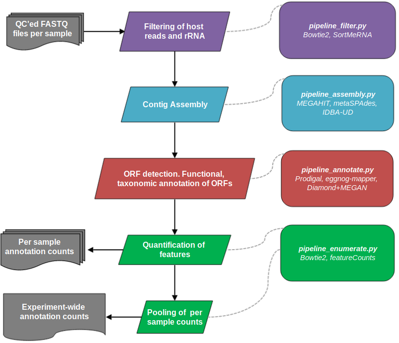

# MetaSequencing
A series of pipelines for processing metagenomic sequencing data within the **[CGAT](https://github.com/cgat-developers/cgat-core)** framework, **MetaSequencing** pipelines are centered around contig assembly and denovo ORF detection at the per sample level. Annotation counts are then pooled across samples for subsequent analyses. The current implementation is summarised below:



## Installation

MetaSequencing depends on installation of **[CGATCore](https://github.com/cgat-developers/cgat-core)**. This is a framework for running bioinformatics pipelines built around the **[Ruffus](http://www.ruffus.org.uk/)** library that automatically handles job submission on HPC clusters. CGAT installation instructions can be found [here](https://github.com/cgat-developers/cgat-core).

Bioinformatics tools and R packages used by the pipelines are detailed at the head of each pipeline script and should be installed as required. MetaSequencing pipelines can then be used by cloning or downloading this repository and running scripts as detailed below.

## Running MetaSequencing pipelines

Each stage/pipeline within MetaSequencing can be called independently. Pipelines are run within working directories containing the FASTQ files to be analysed. The pipelines have largely been tested using paired-end FASTQ files but have been developed to handle other formats for certain jobs.

When running multiple stages, the output files of each step can be symlinked into new directories for subsequent stages. Example commands used to produce a full analysis can be found [below](###Example-Run). 

### Configuration

Before running a pipeline it must be configured by specifying its parameters within the associated YAML file. Example *.yml* files can be found in the *pipelines/pipeline_x* folders.

For instance, settings for the *pipeline_filter.py* pipeline, such as skipping rRNA filtering, can be adjusted in the *pipeline_filter/pipeline.yml* file. The *.yml* file can be edited within the pipelines folder to set the parameters for every run or, if using custom parameters for a single run, a copy can be generated in the working directory by calling (for example):

`python MetaSequencing/pipelines/pipeline_filter.py config`

Any settings set in the *pipeline.yml* file in the working directory will overwrite those set in the global settings files in the pipelines folders.

### Running

Once configured, a pipeline (e.g. *pipeline_filter*) can be called using:

`python MetaSequencing/pipelines/pipeline_filter.py make full`

This will run all jobs within the pipeline on the FASTQ files in the working directory. The pipelines expect files to have a specific suffix naming system as detailed in the pipeline scripts.

Individual jobs within each pipeline can also be called, such as only rRNA filtering, using:

`python MetaSequencing/pipelines/pipeline_filter.py make runSortMeRNA`

A list of jobs that each pipeline carries out can be seen by running `python pipeline_filter.py show full`.

The pipelines automatically handle tracking of jobs. If a job crashes, re-running the pipeline should only carry-out those jobs which are incomplete.

More info on general running of CGAT pipelines can be found [here](https://cgat-core.readthedocs.io/en/latest/index.html).

### Reports

Once a pipeline has finished a full run, basic reports summarising the outputs can be generated.
For example for *pipeline_filter* the command would be:

`python MetaSequencing/pipelines/pipeline_filter.py make build_report`

HTML reports are output to *report.dir*.

### Example Run

Below is an example of commands that could be used for a complete MetaSequencing run. This assumes starting from paired-end FASTQ reads that have undergone prior QC (trimming and quality filtering) and have the naming system *SampleName.fastq.1.gz* and *SampleName.fastq.2.gz*.


```sh

#make a folder and symlink the starting reads
mkdir Filter
cd Filter
ln -s path_to_reads/*.gz ./
#generate the pipeline configuration file (this will need to be edited to set parameters) 
python MetaSequencing/pipelines/pipeline_filter.py config
#run the full filtering step
python MetaSequencing/pipelines/pipeline_filter.py make full
#make a summary report
python MetaSequencing/pipelines/pipeline_filter.py make build_report

mkdir ../Assemble
cd ../Assemble
ln -s ../Filter/filtered_reads.dir/* ./
python MetaSequencing/pipelines/pipeline_assembly.py config
python MetaSequencing/pipelines/pipeline_assembly.py make full
python MetaSequencing/pipelines/pipeline_assembly.py make build_report

mkdir ../Annotate
cd ../Annotate
#can select contigs from any of the assembly methods
#can assign taxonomy at the ORF level (using aa alignment in Diamond with MEGAN LCA) or contig level (using nt alignment in Kraken2)
ln -s ../Assemble/contigs.dir/metaspades/* ./
python MetaSequencing/pipelines/pipeline_annotate.py config
python MetaSequencing/pipelines/pipeline_annotate.py make full
python MetaSequencing/pipelines/pipeline_annotate.py make build_report

#note in pipeline_enumerate the contig/annotation directory is passed to the pipeline in the yml file
#we symlink the filtered reads from pipeline_filter to the working directory
mkdir ../Enumerate
cd ../Enumerate
ln -s ../Filter/filtered_reads.dir/* ./
python MetaSequencing/pipelines/pipeline_enumerate.py config
python MetaSequencing/pipelines/pipeline_enumerate.py make full
python MetaSequencing/pipelines/pipeline_enumerate.py make build_report

#Experiment-wide pooled annotation counts can then be found in Enumerate/combined_counts.dir

```


